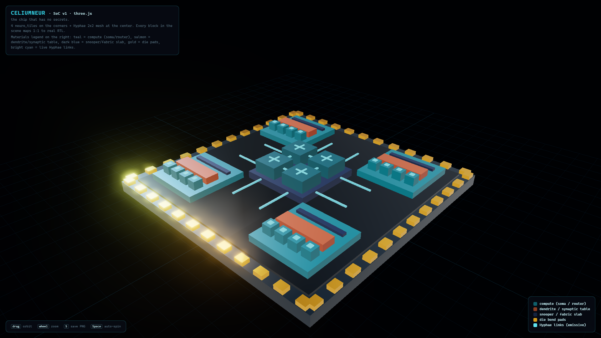

# CeliumNeUR

**The chip that has no secrets.**

[](LICENSES/AGPL-3.0.txt)
[](LICENSES/CC-BY-4.0.txt)
[](#quickstart)
[](#quickstart)
[](#quickstart)
[](rtl/)
[](#quickstart)

A verification-first neuromorphic SoC v1: four event-driven neuro_tiles on a
2×2 credit-based fabric, built against a structural audit of published open
RTL, verified per-invariant by golden-model parity, cocotb simulation, formal
bounded checking, and mutation-killing gates.



---

## Why this exists

Every open neuromorphic chip we audited (ODIN, ReckOn, comparable
accelerators, a TinyTapeout SNN) carries at least one silent-drop,
stale-learning, or clock-crossing pathology in its ship-visible RTL
(evidence in `SPEC.md`, invariants I1–I8). CeliumNeUR is the answer built
the other way around: invariants first, then silicon.

**The three legs of the claim:**

| Leg | Meaning | Where the proof lives |
|---|---|---|
| **Transparent (I5)** | every thought readable without halting the chip | `golden/` raster twins + readback path |
| **Cannot drop a spike (I1)** | credit-based end-to-end; no drop path exists anywhere | formal BMC-60 over the fabric, shadow-audit per test |
| **Learns without stopping (I4)** | concurrent plasticity snoops the fabric; the network keeps listening while it adapts | trajectory on `golden/demo_plasticity.py` vs RTL paired trajectory per round |

---

## Quickstart

**Environment (the easy way, no tapeout software):** Python 3.11+, a
system `iverilog` (Icarus >= 12 or OSS CAD Suite), and cocotb >= 2.0.

```bash
python -m venv .venv && source .venv/bin/activate
pip install cocotb pytest matplotlib

# golden models (bit-exact referees)
python -m pytest golden -q            # 53 golden tests

# whole-chip verification suite (fabric, soma, tile, SoC)
python verification/cocotb/run_tests.py

# regeneration of the README figures (raster twins + learning trajectory)
#   — run the soc bench first; the chip panel reads its real fire log
python tools/make_demo_figures.py
python tools/make_architecture_diagram.py
```

The full-flow evidence also runs under WSL2 with the OSS CAD Suite
(pinned build) or on any dedicated Linux build box; see
`tools/bootstrap_buildbox.sh` and `tools/push_and_run.sh` for the
one-command remote path we actually use.

## The working chip — proof instead of promise

| Signal | Value (same alphabetic order of ticks) |
|---|---|
| Chip fire log (RTL) | `[0,0,0, 4,4,4, 8,8, 12]` |
| Golden sandbox fire log | `[0,0,0, 4,4,4, 8,8, 12]` |


The coincidence detector demo (lone input decays, paired inputs fire the
detector, the output's refractory eats the immediate repeat) runs with
bit-identical behavior on silicon-flow RTL and on the Python golden
referee: since the 2026-08-13 closure pass the fire logs are
**exact-multiset equal** (asserted by test — electrodes ×3 each,
detector ×2, output ×1; see SPEC.md "Closure pass" for the two real RTL
bugs this exposed). Bench tick labels differ from sandbox phase indices
by a fixed shift only (labeling convention, asserted in the test).

## Architecture at a glance


- **Hyphae mesh** (2×2): X–Y dimension-ordered routing, multicast by
  branch replication, credit-based flow control, one hardened CDC cell.
  Packet = 32 bits: `type | reserved | dst mask | source-tick parity | gid`.

- **SomaCore**: improved LIF (saturating arithmetic, subtractive-or-zero
  reset, per-neuron threshold/leak/refractory, ceiling-division leak).

- **Dendrite (I2)**: synaptic indirection table — topology lives in an
  addressable table, never in memory geometry.

- **Snooper / CWR (I4)**: the causal-window rule (pair-based: LTP at fire,
  LTD at window expiry, saturating at ±127) snooping the fabric in the
  background — the name "pair-STDP v1.2" was retired; a comparison against
  reference Song–Miller–Abbott STDP is listed as future work in SPEC.md.
  Golden-side learning run: `golden/demo_plasticity.py`.

- **SomaTile**: tile = soma + dendrite + snooper + skid input buffer;
  the axon-side packetizer emits spikes with source-tick parity so the
  fabric can do phase-gated delivery (closed-form timeline equality).

- **Observability**: synaptic tables and soma state readable while
  running, without halting computation.


The paired wire (A→detector) potentiates to the +127 rail over 30 rounds
while the never-paired control wire (C→detector) depresses toward the
floor — real trajectory from `golden/demo_plasticity.py`, nothing
hardcoded. Regenerated by `python tools/make_demo_figures.py`.

Full physical claim, assumption ledger, and verification bill of
materials: see `SPEC.md`.

## Repository map

```
celiumneur/
├── LICENSE                    (dual: code AGPL-3.0+, docs CC BY 4.0)
├── LICENSES/AGPL-3.0.txt
├── LICENSES/CC-BY-4.0.txt
├── NOTICE.md                  (provenance + audited works)
├── SPEC.md                    (invariants, ledger, formal scope, debts)
├── rtl/                       (verified Verilog-2001)
│   ├── hyphae/                (router, link fifo, hardened CDC fifo)
│   ├── soma/                  (soma_core, soma_dendrite, neuro_tile)
│   └── top/                   (hyphae_mesh_2x2, celiumneur_soc)
├── golden/                    (bit-exact referees + demo nets + raster)
├── verification/
│   ├── cocotb/                (suite runner + per-module benches)
│   ├── formal/                (sby BMC-60 harness wrappers)
│   └── probes/                (hand smoke tests for bring-up)
├── tools/                     (push_and_run, bootstrap, sweeps, render)
└── render/                    (posters, die renders, three.js scene)
```

## Licensing

- **Code**: AGPL-3.0-or-later (`LICENSES/AGPL-3.0.txt`).
- **Docs, posters, renders**: CC BY 4.0 (`LICENSES/CC-BY-4.0.txt`).
- See `NOTICE.md` for the audited prior work this stands on. No third-party
  RTL was incorporated; the audit informed the invariants only.

## Cite

If you build on this, see `CITATION.cff`. A Zenodo DOI will be linked
here upon minting.

---

*CeliumNeUR — a Celiums Solutions LLC project. Hardware that can be
watched thinking, verified as it thinks.*
