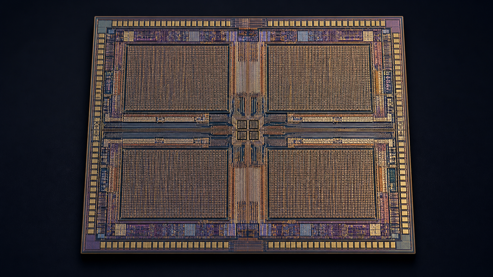
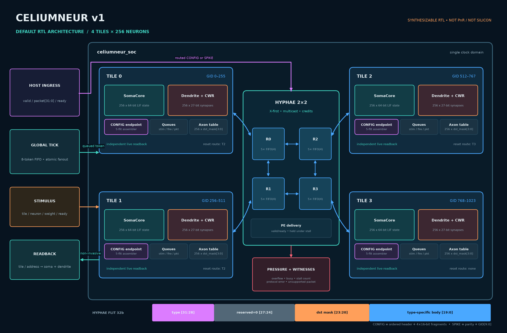
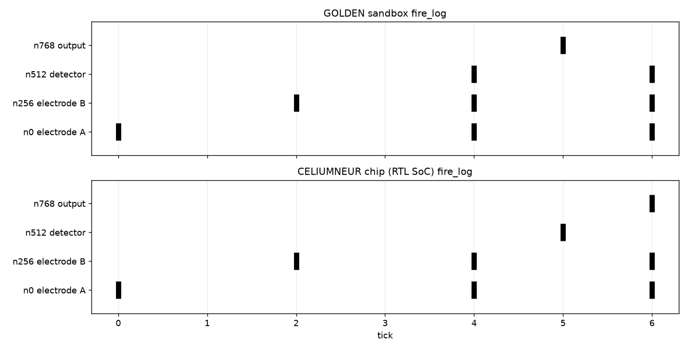
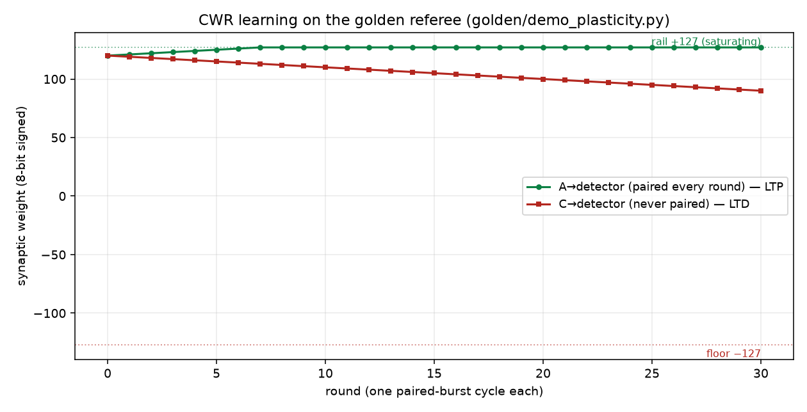

# CeliumNeUR

**A transparent, verification-first neuromorphic SoC in synthesizable Verilog.**

[](LICENSES/AGPL-3.0.txt)
[](LICENSES/CC-BY-4.0.txt)
[](https://github.com/terrizoaguimor/celiumneur/releases/tag/v0.0.2)
[](#verification)
[](#verification)
[](#verification)
[](https://doi.org/10.5281/zenodo.21925426)

CeliumNeUR combines four 256-neuron tiles with a 2×2 credit-based Hyphae
mesh. The default SoC therefore implements 1,024 addressable neuron states,
1,024 addressable synapse entries, routed spike and configuration traffic,
concurrent causal-window learning, and live state readback.

The central engineering rule is precise: when every producer obeys the
published `valid/ready` contract, an accepted spike is either buffered,
processed, or held under backpressure. It is never silently overwritten or
discarded. Sticky witnesses and counters expose malformed traffic and pressure
events instead of hiding them.



*Concept visualization generated with GPT Image 2 from the verified RTL
topology and published neuromorphic-chip floorplan conventions. It is not a
die micrograph, post-layout floorplan, or fabricated silicon. See the
[image provenance record](render/IMAGE_PROVENANCE.md).*



## What is implemented

| Surface | Current implementation |
|---|---|
| Scale | 4 tiles × 256 neurons; GID range 0–1023 |
| Fabric | 2×2 X–Y mesh, multicast branch replication, per-link credits |
| Neuron | Time-multiplexed fixed-point LIF with saturating arithmetic |
| Synapses | 256-entry indirection table per tile, signed 8-bit weights |
| Learning | Concurrent CWR integration/learning walkers, ±127/−128 saturation |
| Configuration | Routed five-flit CONFIG transaction; no host register-write sideband |
| Readback | Independent soma and dendrite read paths while computation continues |
| Diagnostics | Overflow, backpressure, busy, malformed-protocol and unsupported-packet witnesses |

The design is simulation- and synthesis-validated RTL. It is **not** a placed
and routed ASIC, an FPGA bitstream, a timing-closed implementation, or silicon.
The GF180 results are pre-PnR baselines and must not be read as tapeout metrics.

## Architecture

Each `neuro_tile` contains:

- a `soma_core` serving 256 independent 64-bit neuron words;
- a `soma_dendrite` with 256 configurable synapse entries;
- independent integration and learning walkers;
- stimulus, inbound-spike, fire-record, packet and egress queues;
- a 4-bit per-neuron axon destination table; and
- a routed `hypha_config_endpoint` at the tile boundary.

The SoC accepts global ticks through an eight-token FIFO and dispatches each
accepted tick atomically when all four tiles are ready. Stimulus injection has
its own queue per selected tile. A physical fire is captured once as a record
that owns both the learning event and the outgoing spike packet; downstream
stalling cannot change its payload.

### Fabric packets

Every Hyphae flit is 32 bits:

```text
[31:28] type      0x1 SPIKE, 0x2 CONFIG
[27:24] reserved  must be zero at a tile endpoint
[23:20] dst_mask  one bit per tile; multicast is allowed in flight
[19:0]  body      type-specific
```

A SPIKE body is `tick_parity[19] | reserved[18:10] | source_gid[9:0]`.
A tile accepts a locally delivered packet only after routing has reduced the
destination mask to that tile's one-hot bit and all reserved bits are valid.

A 64-bit CONFIG write consists of an ordered header plus four 16-bit data
fragments. Spaces select dendrite (`0`), soma (`1`), or axon (`2`). The endpoint
holds the assembled write until the selected target accepts it. Malformed,
nested, or out-of-order fragments set a sticky error and do not mutate state.
See [SPEC.md](SPEC.md#5-routed-configuration-protocol) for the bit layout.

## Verification

The release gate exercises several independent evidence layers:

| Gate | Evidence |
|---|---|
| Golden models | 55 pytest tests, including the published demo trajectory |
| RTL dynamics | 32 cocotb tests across FIFO, router, CDC, endpoint, soma, mesh, tile and SoC |
| Bring-up probes | 8 self-checking raw Icarus/vvp probes |
| Mutation testing | 17/17 targeted mutants killed; stale anchors fail the gate |
| Static analysis | Full default SoC passes Verilator `--lint-only -Wall` with no emitted warnings |
| Formal | FIFO and router bounded model checks to depth 60 |
| Synthesis | GF180 mapping for endpoint/router plus whole-SoC coarse Yosys elaboration |

The formal claims are intentionally bounded. They prove the properties encoded
in the supplied harnesses for 60 steps; they are not an unbounded proof of the
entire SoC. Exact commands, assumptions and remaining limits are recorded in
[SPEC.md](SPEC.md#8-verification-and-reproducibility).

### Reproduce locally

Python 3.12 is the verified host version. Icarus Verilog and Verilator must be
available on `PATH`.

```bash
python -m venv .venv
source .venv/bin/activate
python -m pip install --require-hashes -r requirements-lock.txt

python -m pytest -q golden
python verification/cocotb/run_tests.py
python verification/cocotb/run_tests.py --probes
python tools/mutant_sweep.py all
```

The mutation tool also accepts individual groups (`hypha_link_fifo`,
`hypha_router`, `hypha_sync_fifo`, `soma_core`, `soma_dendrite`,
`hypha_config_endpoint`, `soc_scale`). The CI workflow runs the golden,
cocotb, probe and Verilator gates from the same hash-locked Python dependency
set. A checked-in workflow is configuration evidence; only a hosted run on the
published revision is CI execution evidence.

For the Linux verification box used by this project:

```bash
bash tools/push_and_run.sh          # cocotb suite
bash tools/push_and_run.sh probes   # raw probes
bash tools/push_and_run.sh mutants  # 17-mutant gate + receipt
bash tools/push_and_run.sh lint     # Verilator -Wall + receipt
bash tools/push_and_run.sh formal   # BMC-60 + receipt
bash tools/push_and_run.sh synth    # synthesis + receipt
```

Remote receipts bind the base commit, working-tree diff, source manifest,
toolchain versions, outputs and SHA-256 hashes. They are machine-local evidence
unless separately archived.

## Demonstration figures

The raster and learning figures are generated from executable models and RTL
test output, not manually drawn traces:

```bash
python verification/cocotb/run_tests.py celiumneur_soc
python tools/make_demo_figures.py
python tools/make_architecture_diagram.py
```





The demo uses neuron 0 in each 256-neuron tile, so its global IDs are 0, 256,
512 and 768. The scale boundary test separately configures tile 3 neuron 255
and verifies an emitted GID of 1023.

## Repository map

```text
rtl/hyphae/           link FIFO, router and hardened CDC FIFO
rtl/soma/             soma, dendrite/CWR and composed neuro_tile
rtl/top/              2×2 mesh, CONFIG endpoint and default SoC
golden/               bit-exact Python referees and executable demos
verification/cocotb/  module, adversarial and end-to-end RTL tests
verification/formal/  SymbiYosys BMC harnesses
verification/probes/  raw self-checking Verilog probes
tools/                verification, mutation, synthesis and render tools
render/               generated architecture and presentation assets
```

## Scope and open work

The current repository does not yet provide physical memory macros, CDC use in
the default single-clock SoC, CONFIG reads over the mesh, a host software stack,
unbounded liveness proofs, timing closure, power characterization, PnR, FPGA
deployment, or silicon measurements. CWR is a small causal-window adaptation
rule, not a claim of biological fidelity or equivalence to reference STDP.

## Licensing and citation

- Code: AGPL-3.0-or-later.
- Documentation and artwork: CC BY 4.0.
- Audited prior work informed the invariants; no third-party RTL was copied.
  See [NOTICE.md](NOTICE.md) for third-party boundaries and the
  [reproducible audit pack](audit/README.md) for exact commits and evidence.

> Gutierrez, M. (2026). *CeliumNeUR — a verification-first neuromorphic
> SoC v1* (v0.0.2). Celiums Solutions LLC.
> https://doi.org/10.5281/zenodo.21925426

See [CITATION.cff](CITATION.cff) for the machine-readable record and
[CHANGELOG.md](CHANGELOG.md) for release history.
